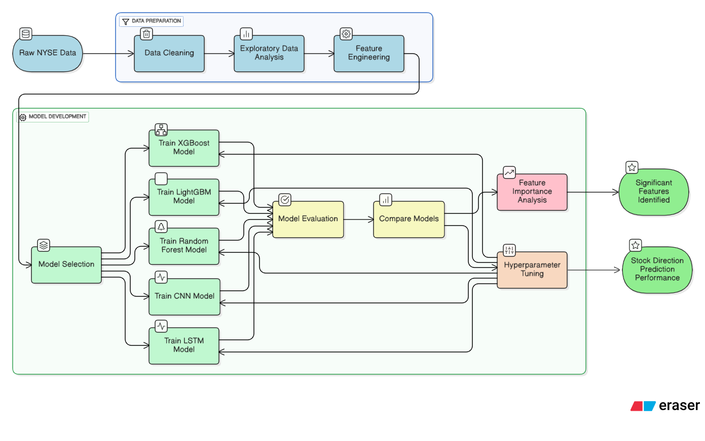
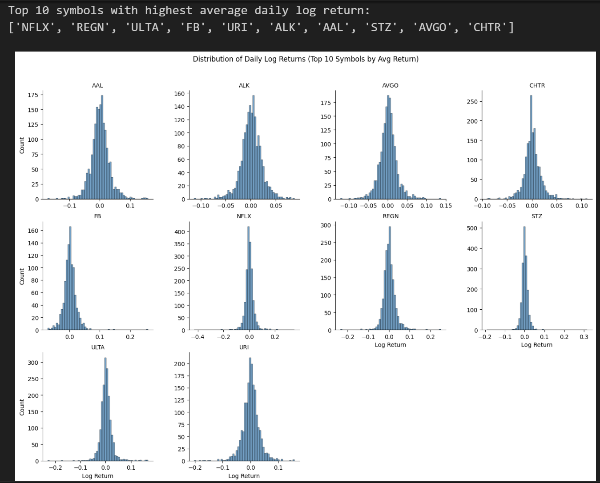
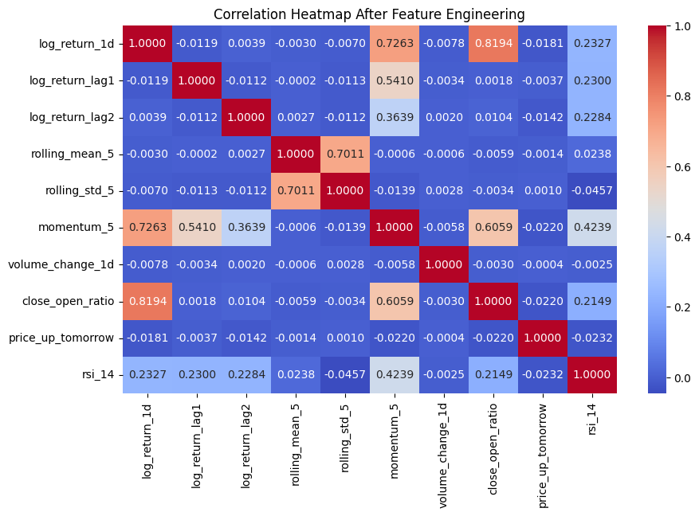
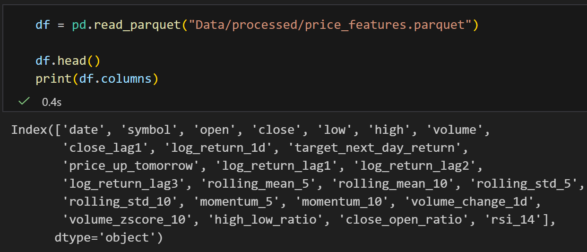

# Stock Index Trend Prediction using Machine Learning on NYSE Data

## Data Science Institute - Cohort 7 - Team ML 08

**Members**
- [Mahshid Chekini](https://github.com/MahChek)
- [Senthil Arumugam](https://github.com/senthilarumugamsub)
- [Ashwinder Singh](github.com/ashwinder1)
- [Muhammad Faisal](https://github.com/faisalapp)

## Project Overview:

This project applies **supervised machine learning** to forecast **stock price trends** using data from the **New York Stock Exchange (NYSE)**. The objective is to predict the **direction of stock price movement** (increase or decrease), empowering investors, traders, and portfolio managers with **data-driven insights** for market decisions.

By leveraging historical price data (split-adjusted) and technical indicators, this project demonstrates how **modern ML techniques** can enhance traditional **technical analysis**, providing scalable and interpretable solutions for **market trend forecasting**.

### Business Problem

Financial markets move rapidly, and anticipating price direction is essential for traders and investors. Traditional chart-based or indicator-driven approaches often suffer from subjectivity and lag.
Huddle with MahChek, Muhammad Faisal, Senthil Arumugam S
Our project bridges this gap by applying machine learning to historical NYSE data, providing an evidence-based framework for predicting stock index trends andHuddle with MahChek, Muhammad Faisal, Senthil Arumugam S identifying patterns not easily visible through manual analysis.

### Stakeholders & Relevance

| Stakeholder | Interest / Why They Care |
| ----- | ----- |
| **Retail Investors** | Want accurate short-term predictions to make informed buy/sell decisions. |
| **Portfolio Managers / Financial Analysts** | Need data-driven insights for portfolio optimization and risk management. |
| **Algorithmic Traders** | Seek predictive signals for automated strategy execution. |
| **Data Scientists / Quant Researchers** | Benefit from benchmark models and feature engineering techniques for stock time-series. |
| **Educational Institutions / ML Learners** | Gain reproducible project examples for time-series financial modeling. |


### Risks and Uncertainties

**Market and Data Risks**

* **Volatility & Non-stationarity:** Stock market dynamics change frequently, making long-term model stability challenging.  
* **External Factors:** Models cannot capture sudden macroeconomic shocks, policy changes, or news events.  
* **Data Lag:** Using only historical data limits reaction to real-time market conditions.

**Modeling Risks**

* **Overfitting:** Deep models like CNN and LSTM may overfit to short-term patterns if not properly regularized.  
* **Feature Leakage:** Derived indicators might indirectly include future information; careful time-order validation is required.  
* **Imbalanced Trends:** Prolonged bullish or bearish phases can skew model performance.  
* **Interpretability:** Deep learning models may be harder to explain to financial decision-makers.

Mitigation includes rolling-window validation, regularization, and model explainability analysis.

## Project Objective

- Developed a reproducible ML pipeline for predicting stock price direction using engineered technical features.

* Predict directional trends (price increase or decrease) for NYSE stocks.  

* Evaluate multiple models (Linear Regression, XGBoost, CNN, LSTM) for trend prediction performance.  

* Assess model interpretability using SHAP or feature importance visualization.

- Evaluated models on accuracy, precision, recall, and ROC-AUC to identify the most effective approach for time-series trend forecasting.

> Ultimately, deliver a prototype for data-driven stock trend forecasting that can serve as a foundation for analysts, researchers, or trading systems.

## Setup and Installation

### Prerequisites
- Python ≥ 3.9
- Git / GitHub
- Jupyter Notebook or VS Code

### Installation Steps

1.   Clone the repository
    
    `git clone https://github.com/ashwinder1/Stock-Trend-Analysis-with-NYSE.git cd Stock-Trend-Analysis-with-NYSE` 
    
2.  Create and activate environment
    
    `conda env create -f requirements.yml
    conda activate stock-trend` 
    
3.  Launch Jupyter Notebook
    
    `jupyter notebook`


## Dataset Overview

-   **Source:** [Kaggle NYSE Dataset](https://www.kaggle.com/datasets/dgawlik/nyse)
    
-   **Content:** Split-adjusted price data for 501 S&P companies
    
-   **Period:** 2010–2016 (varies by company listing date)
    
-   **Features:** `date`, `symbol`, `open`, `close`, `low`, `high`, `volume`, `adj_close`


## Methodology and Workflow

We use the approach that answers the business question by quantifying which indicators best predict the direction of price change, directly supporting investment decision-making.

| Stage                      | Description                                                              |
| -------------------------- | ------------------------------------------------------------------------ |
| **1. Data Collection**     | Obtain and preprocess Kaggle NYSE data                                   |
| **2. EDA**                 | Explore distributions, missing values, and correlations                  |
| **3. Feature Engineering** | Compute moving averages, RSI, MACD, Bollinger Bands                      |
| **4. Model Development**   | Train baseline (Logistic, RF, XGBoost) and sequential (LSTM, CNN) models |
| **5. Evaluation**          | Compare models using classification metrics                              |
| **6. Interpretability**    | Use SHAP to visualize feature contributions                              |
| **7. Reporting**           | Summarize results, insights, and visualizations                          |

## Project Workflow



## Project Structure

```
Stock-Trend-Analysis-with-NYSE/
├── data/
│   ├── raw/
│   └── processed/
├── feature/
├── models/
├── images/
├── models
├── production
│   └── src
├── README.md
├── requirements.yml
└── .gitignore
```

**Folder Descriptions:**

-   `data/` → Raw and processed datasets
    
-   `feature/` → Jupyter notebooks for EDA and Feature Engineering
    
-   `models/` → Trained models and pickled files
    
-   `images/` → Visual outputs for documentation

-   `production/` → Code for deploying the model

-   `requirements.yml` → File with all the dependencies
    
-   `.gitignore` → Excludes large or sensitive files

### Key Dependencies

This project relies on a suite of Python libraries and frameworks that support end-to-end data science workflows, including data preprocessing, machine learning, model evaluation, interpretability, and visualization. 

| Category                  | Libraries                                         |
| ------------------------- | ------------------------------------------------- |
| **Data Processing**       | pandas, NumPy                                     |
| **ML / DL Models**        | scikit-learn, XGBoost, LightGBM, Keras/TensorFlow |
| **EDA / Visualization**   | matplotlib, seaborn, scikit-plot |
| **Imbalanced Data**       | imbalanced-learn (SMOTE, ADASYN)                  |
| **Hyperparameter Tuning** | hyperopt, optuna                                          |
| **Interpretability**      | shap                                              |
| **Utilities**             | os, pickle, pathlib                               |

## Planned Deliverables

* Cleaned and merged **technical dataset**  
* Comparative model performance analysis (ML vs Deep Learning)  
* Jupyter notebook for trend forecasting 
* Model interpretability / explainability report  
* Documentation for reproducibility (README \+ Jupyter notebook)

## Results

### EDA and Feature Engineering
  The dataset had information about opening price for the day, Highest price of the day, closing price of the day, Lowest price of the day and volume of stock traded on that day. It contained information on 501 stocks for a span of 6 years. The data was then sorted based on symbol and date.

  The dataset was then inspected for noise like missing values, infinity, NaNs and Winsorised for extreme values.

  The data was then explored for stocks which gave the highest 1 day return in that span. 

  

  The Correlation Heatmap shows that some features like momentum and log of 1 day return had significant correlation. 

  

  Features like 1 day return, Price up tomorrow, momentum, moving average for windows like 5 days and 10 days, relative strength index were calculated and added to the dataframe to anable the model to pick up patterns and classify properly. 

  

  The data with engineered features was then saved into a Parquet file to optimize disk space.

  The Data in the Parquet file was then used by different models (Random Forest, LightGBM, XGBoost, CNN and LSTM).

### Model Implementation
  
  The models that were built to digest this dataset for prediction are listed below.

  1. [Random Forest](https://github.com/ashwinder1/Stock-Trend-Analysis-with-NYSE/blob/main/models/model_randomforest.ipynb): ML model that combines many decision trees that each vote on the final prediction.
    
  2. [LightGBM](https://github.com/ashwinder1/Stock-Trend-Analysis-with-NYSE/blob/main/models/model_LightGBM.ipynb): fast, high-performance gradient boosting framework that uses tree-based learning with optimized histogram-based algorithms.
  
  3. [XGBoost](https://github.com/ashwinder1/Stock-Trend-Analysis-with-NYSE/blob/main/models/model_xgboost.ipynb) (Extreme Gradient Boosting): scalable end to-end tree boosting system that is known to handle non-linear relationships efficiently and works well with tabular data like financial time series.
  
  4. [CNN](https://github.com/ashwinder1/Stock-Trend-Analysis-with-NYSE/blob/main/models/model_CNN.ipynb) (Convolutional Neural Network): deep learning model that uses convolution layers to automatically detect patterns in complex or non-linear data.
  
  5. [LSTM](https://github.com/ashwinder1/Stock-Trend-Analysis-with-NYSE/blob/main/models/LSTM_new%20features.ipynb) (Long Short-Term Memory network): recurrent neural network designed to understand patterns over time useful for time-series prediction.


## Conclusions and Future Directions
   
   The typical metrics across models are listed in Table 1.

   | Model                     | Accuracy | Precision | Recall    | F1-Score  |
   | ------------------------- | -------- | --------- | --------- | --------- |
   | Random Forest             | 0.51     | 0.51      | 0.47/0.56 | 0.48/0.54 |
   | LightGBM                  | 0.52     | 0.52      | 0.17/0.86 | 0.25/0.65 |
   | XGBoost                   | 0.53     | 0.53      | 0.32/0.73 | 0.40/0.62 |
   | Convoluted Neural Network | 0.52     | 0.52      | 0.50/0.52 | 0.34/0.35 |
   | LSTM                      | 0.50     | 0.51      | 0.44/0.57 | 0.46/0.54 |

    Despite the architectural diversity, model  accuracy clustered around ≈ 0.50–0.53

    Markets are noisy, and hence performance metrics do not show significant improvement between models.

### Achievements

- The predictive model captures meaningful short-term market behaviors, achieving a statistically significant edge above random chance (AUC 0.545).
- With feature importance, we found that momentum indicators, intraday volatility, and volume anomalies emerge as the primary drivers of next-day price direction.
- Although daily direction prediction is inherently noisy, this model can enhance trading decisions by providing a directional bias, informing risk management, and helping detect market trends.

### Next Steps

- Add more alpha factors like MACD, Bollinger Bands etc
- Integrate macroeconomic indicators and some fundamental features
- Use multi-horizon targets and increase the assets
- Predict return magnitude, not just up/down
- Deployment of model in production with real time data like yfinance.

## Team Members Reflection Videos

Each member will provide a short reflection video discussing their role, learning outcomes, and contributions.

1. [Mahshid Chekini](https://drive.google.com/file/d/1_6boV-uJIeJMfO96rKGw1y9YV2X1guOr/view?usp=sharing)
2. [Ashwinder Singh](https://youtu.be/TXOxKToeXkA) 
3. [Senthil Arumugam Subramanian](https://youtu.be/CgZ4qmz1opk)
4. [Muhammad Faisal](https://drive.google.com/file/d/1_6boV-uJIeJMfO96rKGw1y9YV2X1guOr/view?usp=sharing)


